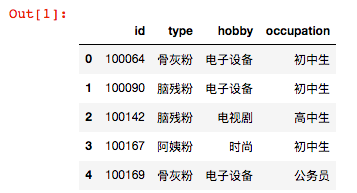

# 项目名称
鹿晗粉丝用户画像建立(User_profile_for_LuhansFans)

# 项目内容
本项目基于新浪微博内容对鹿晗粉丝建立用户画像。
主要分为两部：1. 网页信息爬取 2.基于第一步文本信息对粉丝建立用户画像

# 输出展示
```python3
import pandas as pd
df = pd.read_csv("../../data/results/weibo.csv", names=["id","type","hobby","occupation"])
df["id"] = df["id"]//10000
df["type"] = df["type"] + "粉"
df.head()
```



# 依赖
**gensim** - 语义主题建模

**numpy** - 科学计算

**jieba** - 中文分词

**pandas** - 结构化数据分析工具

**sklearn** - 机器学习库

# 预训练语料库
本项目使用的预训练语料库基于微博文本而建立。(Word + Character + Ngram)

Shen Li, Zhe Zhao, Renfen Hu, Wensi Li, Tao Liu, Xiaoyong Du, [Analogical Reasoning on Chinese Morphological and Semantic Relations](http://aclweb.org/anthology/P18-2023), ACL 2018.

# 作者
胡青云：算法工程师

张耀：爬虫工程师

郑嘉宇：爬虫工程师兼组长

杨艺：需求分析师

聂旗:项目顾问
